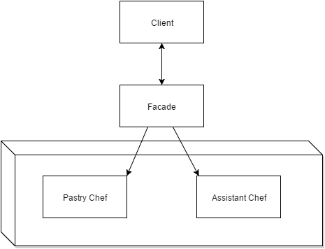

# Facade

### Scenario of use:
    The Facade pattern is used to obscure classes which have too many methods.The pattern is used as means to provide a simplified interface to a larger system of subclasses - functionality can be achieved with minimal manual work by the user.
    
### Benefits:
    Cuts the manually invoked methods to minimal
    Decouples code
    Improved cohesion
    Easy to modify
    Provides a more simplified view
    
### Drawbacks:
    May sometimes hide ugly and/or code that is not optimized

    
### Real world example:
- The [Pastry Chef preparing a cake](./PastryChefFacade.cs) example exposes only 4 public methods, which obscure functionality that is there, but would be otherwise too much of a hassle to deal with by invoking the separate methods (look up [PastryChef.cs](./PastryChef.cs) & [AssistantChef.cs](./AssistantChef.cs))
- Connecting to an exposed WiFi network works in a similar way - the device checks for available networks, asks for a slot, provides credentials, receives a response and finally connects, additionally asks for a secret key, or rejects the user.