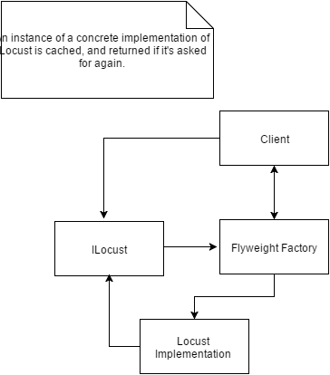

# Flyweight

### Scenario of use:
    The Flyweight pattern
    
### Benefits:
    ...
    
### Drawbacks:
    ...

    
### Real world example:
- The [Pastry Chef preparing a cake](./PastryChefFacade.cs) example exposes only 4 public methods, which obscure functionality that is there, but would be otherwise too much of a hassle to deal with by invoking the separate methods (look up [PastryChef.cs](./PastryChef.cs) & [AssistantChef.cs](./AssistantChef.cs))
- Connecting to an exposed WiFi network works in a similar way - the device checks for available networks, asks for a slot, provides credentials, receives a response and finally connects, additionally asks for a secret key, or rejects the user.